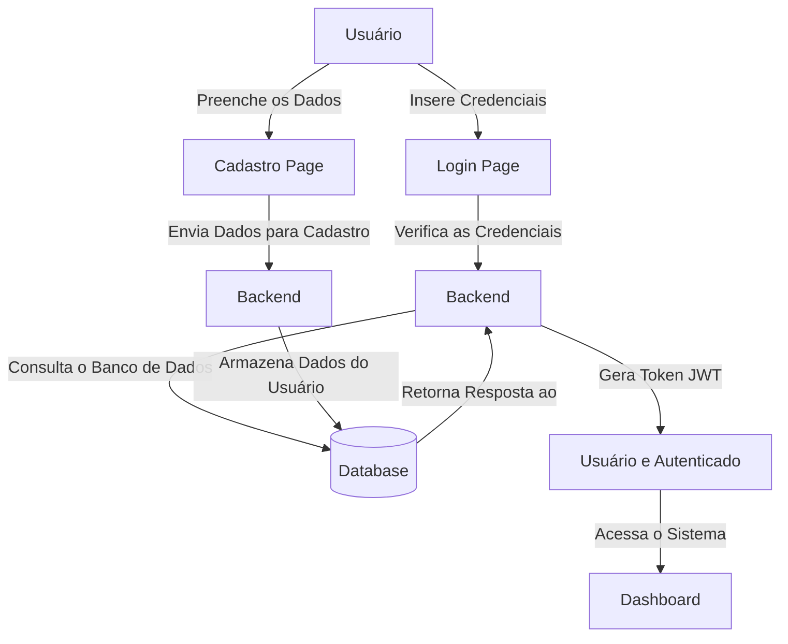

# 🔐 Sistema-login-cadastro
Versão 2 do meu primeiro projeto de login e cadastro.

## 📌  Descrição

Este projeto tem como objetivo criar a versão número 2 do sistema de login e cadastro para usuários. Ele utiliza JWT (JSON Web Token) para autenticação e realiza a verificação e armazenamento de dados no banco de dados (MySQL).

### ✅ Funcionalidades:
- 📝 Cadastro de novos usuários.
- 🔑 Login com verificação de credenciais.
- 🛡️ Geração de **Token JWT** para autenticação.
- ✅ Acesso ao sistema após autenticação.

## 🛠️ Tecnologias Utilizadas:
- ### Backend
- **Java 17** ☕
- **Spring Boot** 🔧
- **JWT (JSON Web Token)** 🔑
- **MySQL** (Banco de Dados) 🗄️
- **Spring Security** 🔒
- ### Frontend
- **Angular 18 🅰️**

## 🔄 Diagrama de Fluxo

Abaixo está o diagrama de fluxo do sistema, mostrando como as operações de **login** e **cadastro** funcionam.



## 🐳 Passos para Dockerizar o Projeto
### 1️⃣ Criar o Dockerfile
📌 Na raiz do projeto, crie um arquivo chamado Dockerfile e adicione o seguinte conteúdo:
```bash
    # Utiliza a imagem oficial do OpenJDK 17
    FROM openjdk:17-jdk-slim

    # Define o diretório de trabalho dentro do container
    WORKDIR /app

    # Copia o arquivo JAR gerado para dentro do container
    COPY target/sistema-login-cadastro.jar app.jar

    # Expõe a porta 8080 para comunicação
    EXPOSE 8080

    # Comando para executar a aplicação
    ENTRYPOINT ["java", "-jar", "app.jar"]
```
### 2️⃣ Criar o arquivo docker-compose.yml
📌 Esse arquivo permite rodar a aplicação junto com o banco de dados PostgreSQL/MySQL dentro de um container.
Crie um arquivo chamado docker-compose.yml na raiz do projeto e adicione o seguinte conteúdo:
```bash
services:
  mysql:
    image: 'mysql:latest'
    environment:
      - 'MYSQL_DATABASE=mydatabase'       # Cria o banco de dados 'mydatabase'
      - 'MYSQL_ROOT_PASSWORD=senha-root'      # Senha para o usuário root
      - 'MYSQL_USER=myuser'               # Nome do usuário regular
      - 'MYSQL_PASSWORD=senha-myuser'           # Senha para o usuário regular
    ports:
      - '3307:3306'                       # Mapeia a porta 3306 do container para a 3307 no host
```

## 🐳 Executando com Docker

### 📌 **1. Criar o JAR do Projeto**
Antes de rodar o Docker, gere o arquivo JAR do seu projeto:

```bash
mvn clean package
````

### 📌 2. Construir e Rodar o Container
Usando docker-compose, apenas execute:

```bash
docker-compose up -d
```

## 🚀 Como Usar

### 📌 Pré-requisitos:
- **Java 17** ou superior.
- **Spring Boot** instalado.
- **Banco de Dados** (MySQL).

### 📌 Passos para Execução:

1. **Clone o repositório 🔽**:
   No terminal, execute o seguinte comando para clonar o repositório:
   
   ```bash
   git clone https://github.com/norwalneto/sistema-login-cadastro.git
   ```
   
3. **Acesse a pasta do projeto 📁**:
   Navegue até o diretório do projeto clonado:
   
   ```bash
   cd sistema-login-cadastro
   ```
      
4. **Configure as credenciais do banco de dados ⚙️**
   Abra o arquivo src/main/resources/application.properties e adicione as credenciais do seu banco de dados (MySQL):
   
   ```bash
    # Configuração do banco de dados MySQL
    spring.datasource.url=jdbc:mysql://localhost:3307/habita_recife_backend?createDatabaseIfNotExist=true&serverTimezone=UTC&useSSL=false&allowPublicKeyRetrieval=true
    spring.datasource.username=seu-usuario-root
    spring.datasource.password=sua-senha-root
    spring.datasource.driver-class-name=com.mysql.cj.jdbc.Driver

    # Configuração do Hibernate e JPA
    spring.jpa.database-platform=org.hibernate.dialect.MySQL8Dialect
    spring.jpa.hibernate.ddl-auto=update
   ```
   
6. **Instale as dependências 📦**:
   
   ```bash
    mvn clean install
   ```

7. **Execute o projeto ▶️:**
   Após configurar o banco de dados, execute o projeto com o Maven:
   
   ```bash
    mvn spring-boot:run
   ```
